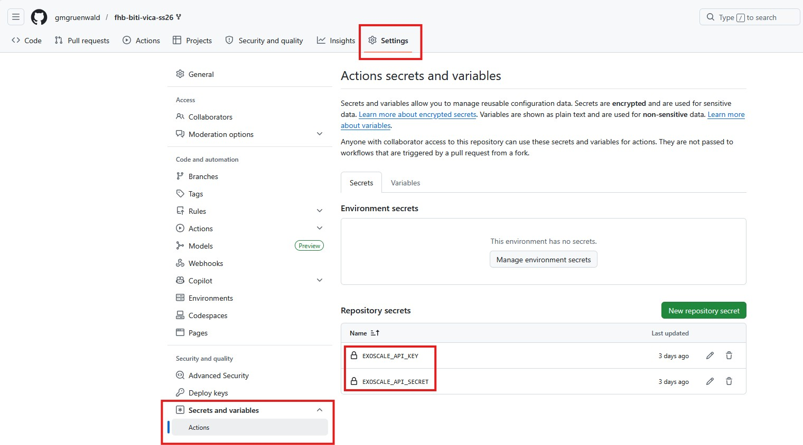
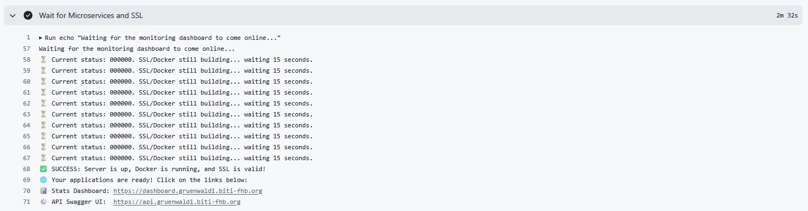
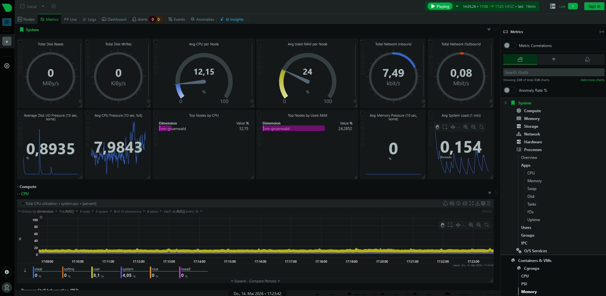
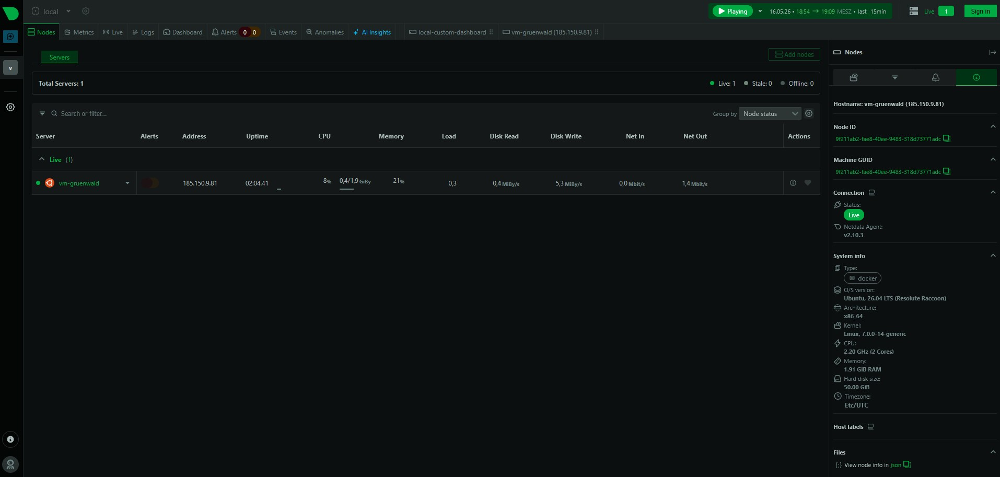
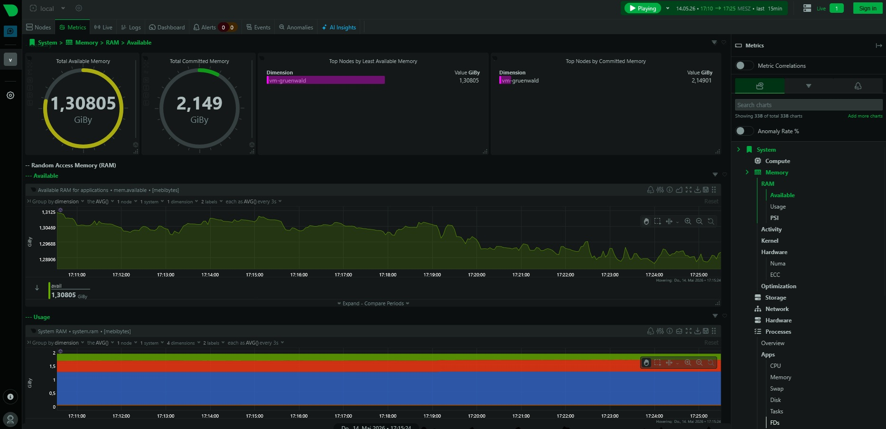
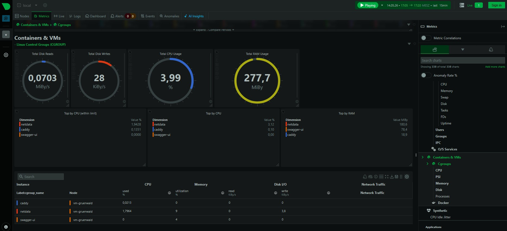
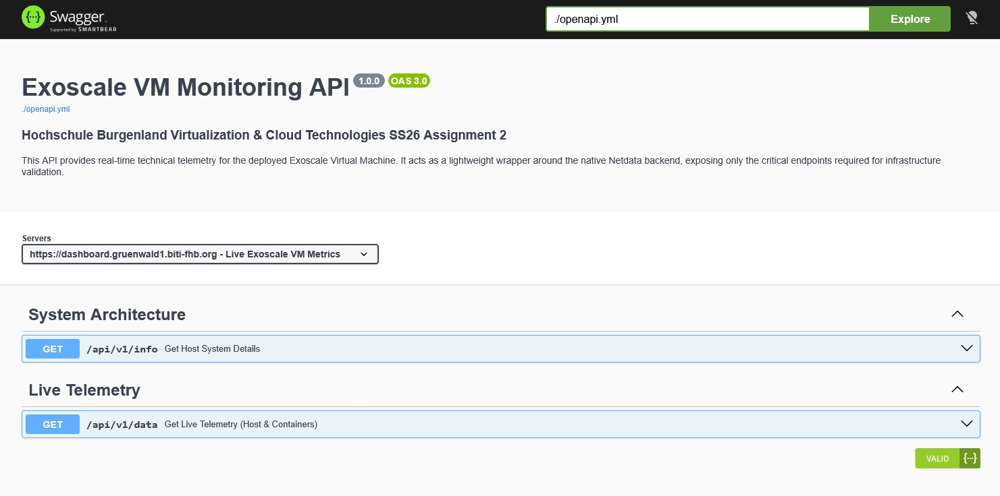
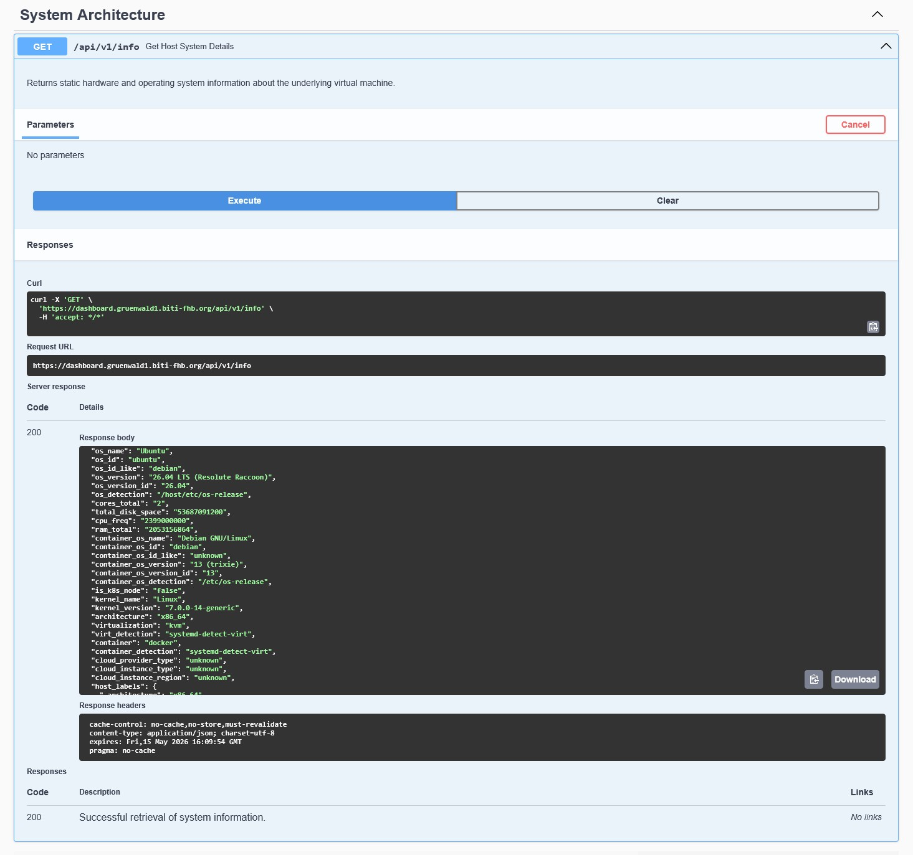
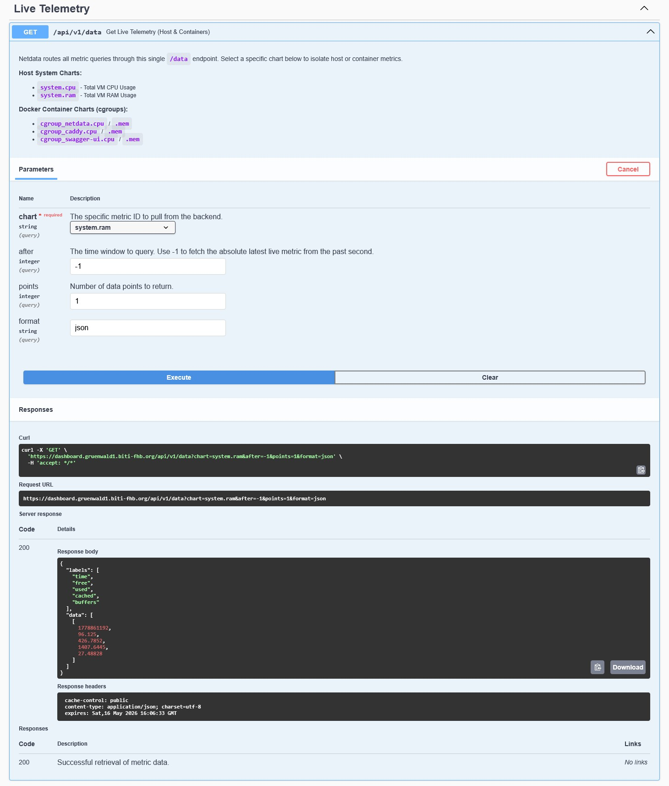

# Architekturdokumentation: Automatisiertes Exoscale VM-Monitoring

**Erstellt von:** Georg Grünwald  
**Kurs:** Virtualisierung & Cloud-Technologien SS26 (Aufgabe 2)

---

## 1. Management Summary & Architektur-Überblick

Das vorliegende Projekt automatisiert die Bereitstellung einer
cloud-basierten Monitoring-Lösung auf Exoscale. Durch den Einsatz von
Infrastructure as Code (OpenTofu/Terraform) und Configuration Management
(Cloud-Init) wird eine Ubuntu 26.04 LTS Instanz vollständig ohne manuelle
Eingriffe provisioniert.

Die Architektur folgt einem modernen, containerisierten Ansatz. Auf der
virtuellen Maschine läuft ein Docker-Compose-Stack bestehend aus drei
Kernkomponenten:

- **Netdata:** Dient als primäre Datenquelle und liefert Low-Level
  Systemmetriken der Host-VM (Speicher, CPU, Kernel) sowie
  Container-Telemetrie.

- **Swagger UI:** Bietet eine interaktive, dokumentierte API-Schnittstelle
  im JSON-Format basierend auf einer maßgeschneiderten
  OpenAPI-Spezifikation.

- **Caddy Reverse Proxy:** Fungiert als API-Gateway und
  TLS-Terminierungspunkt, der den eingehenden Traffic sicher auf die
  jeweiligen Microservices verteilt.

---

## 2. Erfüllung der Zusatzpunkte

Um die Kriterien für die Zusatzpunkte zu erfüllen, wurde die Infrastruktur
um fortgeschrittene Routing- und Sicherheitskonzepte erweitert.

### A. Korrekte Verwendung von DNS und TLS/HTTPS-Zertifikaten

Die Verknüpfung von dynamischen Cloud-Ressourcen mit statischen Endpunkten
wurde über DNS-Automatisierung gelöst:

- Terraform fragt die Basis-Domain (`biti-fhb.org`) ab und generiert
  dynamisch zwei dedizierte A-Records in der Exoscale DNS-Zone, welche
  auf die Public IP der generierten VM zeigen.

- Der Caddy Reverse Proxy ist so konfiguriert, dass er automatisch beim
  Start über Let's Encrypt vertrauenswürdige HTTPS-Zertifikate für diese
  Subdomains bezieht und verlängert.

- Um API-Rate-Limits während der Entwicklung zu vermeiden, wurde eine
  variable Steuerung (`acme_staging`) implementiert, die nahtlos zwischen
  Staging- und Produktions-Zertifikaten wechseln kann.

### B. Zwei dedizierte Endpunkte für HTML (Website) und JSON (API)

Die Anforderung, Daten sowohl optisch als auch maschinenlesbar
auszuliefern, wurde durch eine Trennung auf Subdomain-Ebene realisiert,
konfiguriert im Caddyfile:

#### HTML Dashboard (`dashboard.gruenwald.biti-fhb.org`)

- Leitet den Traffic sicher an das Netdata-Dashboard weiter.
- Eine Quality-of-Life-Regel leitet den Root-Pfad direkt auf die neue
  `/v3/` UI von Netdata um, um interne Routing-Fehler zu vermeiden.

#### JSON API (`api.gruenwald.biti-fhb.org`)

- Leitet den Traffic an den Swagger UI Container weiter.
- Dort wird eine über Cloud-Init dynamisch injizierte `openapi.yml`
  gerendert, welche dedizierte Endpunkte (`/api/v1/info` und
  `/api/v1/data`) für System- und Container-Metriken im JSON-Format
  bereitstellt.

---

## 3. Engineering-Details (Deep Dive)

Neben den Basisanforderungen wurden architektonische Hürden proaktiv
gelöst, auf die bei der Bewertung besonders geachtet werden sollte.

### Funktionaler Waiting Algorithm (CI/CD Pipeline)

Ein bekanntes Problem bei automatisierten Cloud-Deployments ist, dass
Infrastructure-as-Code-Tools (wie OpenTofu) ihren Job als „erfolgreich"
markieren, sobald die VM gebootet ist. Zu diesem Zeitpunkt laufen im
Hintergrund aber noch Cloud-Init, die Docker-Container-Provisionierung
und die asynchrone Zertifikatsausstellung durch Let's Encrypt.

Um „False Positives" in der Pipeline zu vermeiden, wurde ein funktionaler
Waiting Algorithm in das Deploy-Skript (`gruenwald_deploy.yml`)
integriert, der den Job erst abschließt, wenn die Applikation tatsächlich
online ist:

- **Intelligentes Polling:** Ein Bash-Skript nutzt `curl`, um den
  Netdata-Endpunkt in einer Schleife abzufragen, und wartet spezifisch
  auf einen gültigen HTTP-Statuscode (`200` oder `302`).

- **DNS-Bypass (`--resolve`):** Um Verzögerungen bei der globalen
  DNS-Propagierung zu umgehen (die GitHub-Runner oft betrifft), tunnelt
  der `curl`-Befehl den Request direkt auf die via Terraform ausgelesene
  Public IP der VM, täuscht dem Webserver aber gleichzeitig den
  korrekten Hostnamen für den SSL-Handshake vor.

- **Dynamisches SSL-Handling & Timeout:** Die Schleife (Timeout bei
  10 Minuten) wertet die Terraform-Variable `acme_staging` aus. Ist
  diese aktiv, deaktiviert das Skript temporär die strenge
  SSL-Verifizierung (`--insecure`), damit der Check bei untrusted
  Staging-Zertifikaten nicht fehlschlägt.

Dies garantiert einen deterministischen Pipeline-Status und eine
nahtlose Übergabe an den Nutzer.

### Injektion von Konfigurationsdateien (Maintainability)

Um die `cloud-init.yml` übersichtlich und wartbar zu halten, wurden
große Konfigurationsblöcke (wie das Caddyfile, die OpenAPI- und
Docker-Compose-Konfiguration) in separate `.tftpl`-Dateien (Terraform
Templates) ausgelagert. Terraform rendert diese Dateien zur Laufzeit,
injiziert die benötigten dynamischen Variablen und fügt sie erst im
letzten Schritt nahtlos ein.

### Strategisches API-Design: Der Netdata-Wrapper

Ein zentraler Aspekt dieser Architektur ist die Implementierung einer
eigenen OpenAPI-Spezifikation. Während das Netdata-Backend eine extrem
umfassende API mit tausenden Metriken bereitstellt, fungiert unser Ansatz
als Lightweight-Wrapper.

**Vorteile dieses Wrapper-Designs:**

- **Abstraktion:** Die native Netdata-API ist für allgemeine
  Monitoring-Zwecke konzipiert und daher sehr breit gefächert. Unser
  Wrapper fungiert als kuratierte Schnittstelle (Facade), die nur die
  für diese Infrastruktur-Validierung essenziellen Datenpunkte
  exponiert.

- **Benutzerführung:** Anstatt den Nutzer mit tausenden Chart-IDs zu
  konfrontieren, bietet unser Wrapper eine gezielte Auswahl. Durch
  Enums und vordefinierte Chart-IDs (z.B. `system.cpu`,
  `cgroup_caddy.mem`) wird der Fokus direkt zu den relevanten
  Datenpunkten gelenkt, ohne dass Kenntnisse über interne
  Netdata-Chart-Strukturen nötig sind.

- **Dokumentation:** Die Spezifikation bietet menschenlesbare
  Erklärungen für technische Metriken, was die Transparenz der
  gelieferten Daten erhöht.

### Strict CORS Management

Da Swagger asynchrone Anfragen an Netdata sendet, greifen strikte
CORS-Richtlinien. Anstatt die fehleranfälligen CORS-Header von Netdata
zu nutzen, fungiert Caddy als API-Gateway. Caddy entfernt die
Backend-Header und erzwingt eine zentrale, restriktive CORS-Policy. Der
Zugriff wird nach dem Least-Privilege-Prinzip strikt auf die exakte
Swagger-URL limitiert (keine `*` Wildcards), was CSRF-ähnliche
Datenabflüsse zuverlässig verhindert.

### Isolierte Sicherheit & Host-Header Rewriting

Da Netdata Anfragen von unbekannten Domains mit einem HTTP-400-Fehler
ablehnt, manipuliert Caddy den Header (`header_up Host localhost`), um
Netdata vorzutäuschen, die Anfrage käme vom lokalen System. Gleichzeitig
läuft Netdata für tiefe Systemeinblicke mit Linux-Capabilities
(`SYS_PTRACE`, `SYS_ADMIN`), während der globale externe Zugriff durch
eine restriktive Security Group geschützt ist (SSH Zugriff über
CIDR-Blöcke limitiert).

---

## 4. Initialisierung und Konfiguration

Bevor die Infrastruktur provisioniert werden kann, müssen die Exoscale
API-Zugangsdaten sicher im GitHub-Repository hinterlegt werden, damit
der GitHub Actions Workflow (OpenTofu) sich authentifizieren kann.

1. Im GitHub-Repository zu folgendem Pfad navigieren:

   ```text
   Settings > Secrets and variables > Actions
   ```

2. Klicken Sie auf:

   ```text
   New repository secret
   ```

3. Die folgenden zwei Secrets erstellen (diese entsprechen den
   Variablen in der `variables.tf`):

| Name                  | Wert                    | Datentyp |
|-----------------------|-------------------------|----------|
| `EXOSCALE_API_KEY`    | Der Exoscale API Key    | STRING   |
| `EXOSCALE_API_SECRET` | Das Exoscale API Secret | STRING   |

<br>


> **Abb 1:** Konfiguration der sensiblen Authentifizierungsdaten und
> dynamischen Variablen in GitHub Actions.

> **Hinweis:** Da die Secrets in Terraform als `sensitive` markiert
> sind, werden sie von OpenTofu in den Konsolen-Logs automatisch
> unkenntlich gemacht.

<br>

Unter **Variables** lassen sich optionale Umgebungsvariablen definieren,
um die Konfiguration (z.B. den Sub-Domain-Namen) ohne Code-Änderungen
dynamisch anzupassen.

| Name                  | Wert                      | Datentyp |
|-----------------------|---------------------------|----------|
| `SECOND_LEVEL_DOMAIN` | Die Second Level Domain   | STRING   |
| `ACME_STAGING`        | Staging OFF / ON          | BOOL     |

### Wichtiger Hinweis zu SSL-Zertifikaten (Let's Encrypt Rate Limits)

Beim wiederholten Deployment der Infrastruktur sind die strengen
Limitierungen (Rate Limits) von Let's Encrypt zu beachten. Für exakt
denselben Hostnamen (Fully Qualified Domain Name / FQDN) stellt
Let's Encrypt aus Sicherheits- und Kapazitätsgründen **maximal fünf
identische Zertifikate pro Woche** aus (Duplicate Certificate Limit).

Wird dieses Limit durch zu häufige Neu-Deployments (z. B. während der
Testphase) überschritten, blockiert Let's Encrypt weitere Anfragen.
Dies hat zur Folge, dass der Webserver kein gültiges Zertifikat beziehen
kann. Ohne erfolgreichen SSL-Handshake wird die Anwendung im Browser
mit einem SSL-Fehler blockiert und ist nicht mehr aufrufbar.

**Handlungsempfehlungen und Lösungsansätze:**

- **Nutzung der Staging-Umgebung (Empfohlen für Entwicklung):** Um das
  Rate Limit bei häufigen Deployments proaktiv zu vermeiden, sollte die
  Variable `ACME_STAGING` auf `true` (ON) gesetzt werden. Die
  Staging-Umgebung von Let's Encrypt besitzt deutlich höhere Limits.

> **Hinweis:** Staging-Zertifikate lösen im Browser eine
> Sicherheitswarnung aus, die für reine Funktionstests jedoch ignoriert
> werden kann.

- **Subdomain wechseln (Bei Erreichen des Limits):** Ist das Limit für
  die Produktionsumgebung bereits überschritten, muss bei einem erneuten
  Deployment zwingend ein neuer Hostname gewählt werden. Hierfür ist der
  Wert der Variable `SECOND_LEVEL_DOMAIN` abzuändern (z. B. von
  `gruenwald` auf `gruenwald-v2`), um eine frische Zertifikatsausstellung
  zu erzwingen.

---

## 5. Test- und Prüfanleitung

Zur effizienten Evaluierung der Vollständigkeit und Funktionsweise der
Bereitstellung sind folgende Schritte auszuführen:

### Schritt 1: Automatisierte Provisionierung

1. Den bereitgestellten GitHub Actions **Deploy-Workflow** zur Erstellung
   der Infrastruktur ausführen.

2. Der im Hintergrund laufende Waiting Algorithm prüft kontinuierlich
   den Status der Microservices.

3. Automatisierte Bereitstellung: Sobald der Stack vollständig gebootet
   und das SSL-Zertifikat validiert ist, meldet die Pipeline
   **„SUCCESS"** und generiert die beiden finalen URLs als klickbare
   Links im Logauswurf.

<br>


> **Abb 2:** Die Pipeline wartet aktiv auf den SSL-Handshake und stellt
> die Endpunkte bereit.

<br>

### Schritt 2: Prüfung der HTML-Darstellung (Website)

1. Den im Workflow ausgegebenen Link für die `stats_url` aufrufen.

2. Es öffnet sich das **Netdata-Dashboard** mit der Echtzeit-Telemetrie
   der Ubuntu-VM. Die HTTPS-Verbindung ist gesichert.

Das Dashboard liefert detaillierte Einblicke in die Systemleistung,
darunter globale Übersichten, dedizierte Node-Verwaltung und tiefgehende
RAM-Auswertungen:

<br>


> **Abb 3:** Live-Übersicht der Host-Systemmetriken (CPU, RAM, I/O,
> Load).

<br>


> **Abb 4:** Detaillierte Auswertung der System-Nodes.

<br>

Die detaillierte RAM-Auswertung bietet einen tiefen Einblick in die
Speicherverwaltung des provisionierten Ubuntu-Hosts. Neben der
klassischen Aufschlüsselung in genutzten, gecachten und gepufferten
Arbeitsspeicher visualisiert Netdata auch fortgeschrittene
Systemmetriken wie das Committed Memory (vom Kernel reservierter, aber
noch nicht zwingend beschriebener Speicher).

<br>


> **Abb 5:** Detaillierte Auswertung des Arbeitsspeichers der einzelnen
> System-Nodes.

<br>

Dank der Cgroup-Integration des Docker-Sockets können auch die genutzten
Ressourcen der isolierten Microservices live eingesehen werden:

<br>


> **Abb 6:** Überwachung der einzelnen Docker-Container (caddy, netdata,
> swagger-ui) über Linux Control Groups.

<br>

### Schritt 3: Prüfung der JSON-Darstellung (API)

1. Den im Workflow ausgegebenen Link für die `api_url` aufrufen.

2. Es öffnet sich die zentralisierte **Swagger UI**, welche als
   API-Gateway zum Monitoring-Backend dient.

<br>


> **Abb 7:** Interaktive Swagger-Dokumentation für die
> Systemarchitektur.

<br>

#### Testen des Endpoints `/api/v1/info`

Den Endpunkt aufklappen und auf **Try it out → Execute** klicken. Die
API liefert strukturierte, statische Systeminformationen im JSON-Format
zurück (z.B. OS, Kernel-Version, Virtualisierungstyp).

<br>


> **Abb 8:** Erfolgreicher Abruf der Host-Informationen im JSON-Format.

<br>

#### Testen des Endpoints `/api/v1/data`

Über diesen Endpunkt lässt sich die Live-Telemetrie abrufen. Im
Dropdown `chart` kann gezielt zwischen Host-Metriken (z.B.
`system.ram`) und spezifischen Container-Metriken (z.B.
`cgroup_caddy.mem`) gewählt werden.

Ein Klick auf **Execute** löst einen Cross-Origin-Request an das Backend
aus, greift auf die neuesten Zeitfenster-Daten (`after=-1`) zu und
liefert den aktuellen Live-Wert zurück. Dies bestätigt das erfolgreiche
Zusammenspiel von Caddy-Routing und CORS-Richtlinien.

<br>


> **Abb 9:** Abruf der Live-Ressourcenmetriken. Die Antwort enthält
> saubere JSON-Daten direkt aus der Netdata-Datenbank.

<br>

### Schritt 4: Cleanup

Den bereitgestellten **Destroy-Workflow** in GitHub Actions ausführen,
um sämtliche Cloud-Ressourcen inklusive der DNS-Records automatisiert
und vollständig zu entfernen.
