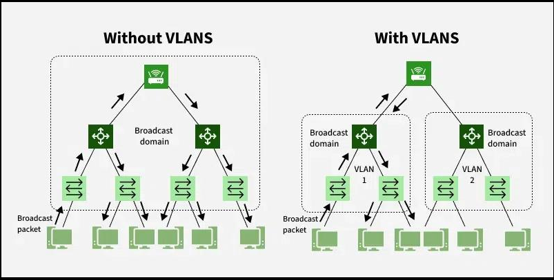
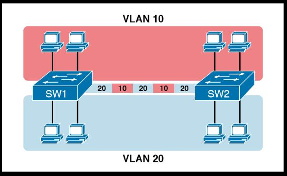
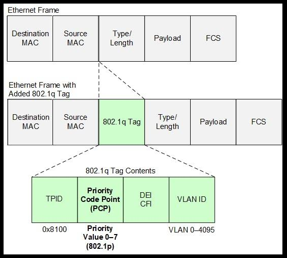
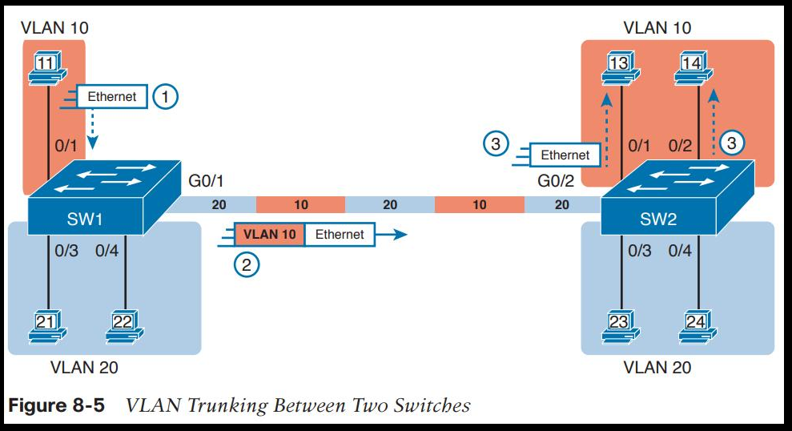

# Ausarbeitung zum Begriff VLAN

*14.04.2026, Juliette Heritage*

## Allgemeine Begriffserklärung

Ein VLAN ist ein Konzept aus dem Bereich Netzwerktechnik und arbeitet auf dem Layer 2 (dem Data Link Layer). In der Netzwerktechnik wird nämlich mit einem Modell aus sieben Schichten gearbeitet, Layer 2 ist die zweit-unterste und kommt somit nach dem Physical Layer.

VLAN steht für **Virtual Local Area Network**. Ein LAN beinhaltet alle Geräte in einer Broadcast-Domäne. Wenn ein Gerät einen Broadcast Frame schickt, dann erhalten alle anderen Geräte im LAN eine Kopie von diesem Frame.

Wenn man einen Switch nur mit Default Settings konfiguriert hat, dann erhält jedes Gerät, das an diesem Switch angeschlossen ist, jedes Frame, das bei einem der Ports eintritt. Wenn man das nicht möchte, kann man VLANs verwenden, also virtuelle LANs. Diese ermöglichen einem, getrennte Broadcast-Domänen zu haben, indem der Switch verschiedene Interfaces zu verschiedenen Domänen konfiguriert.

*Grafik 1: Ohne VLAN befinden sich alle Geräte in einer Broadcast-Domäne, mit VLANs werden diese logisch getrennt.*

## Kontext und Einsatzgebiete

VLANs werden vor allem in größeren Netzwerken eingesetzt, also z. B. in Unternehmen, Schulen oder Rechenzentren. Ziel ist es, Netzwerke logisch zu segmentieren, ohne physisch mehrere Switches oder separate Verkabelung zu benötigen.

Typische Anwendungsfälle sind:

- Trennung von Abteilungen (z. B. HR, IT, Management)
- Trennung von Gästenetz und internem Netzwerk
- Sicherheitsanforderungen (z. B. isolierte Systeme)
- Reduktion von Broadcast Traffic

Ein Beispiel: In einem Unternehmen könnten alle PCs der Buchhaltung in VLAN 10 sein, während die IT-Abteilung VLAN 20 nutzt. Obwohl alle Geräte physisch am gleichen Switch hängen, verhalten sie sich so, als wären sie in komplett getrennten Netzwerken.

## Technische Funktionsweise

Damit ein Switch weiß, in welches VLAN er welche Frames schicken soll, werden sie mit einer VLAN-ID versehen. Das erfolgt meist über das IEEE 802.1Q-Protokoll (VLAN Tagging). Dabei wird ein zusätzlicher Header in den Ethernet Frame eingefügt, der die VLAN-ID enthält.

### Wichtige Begriffe

- **Access Port:** Port gehört genau zu einem VLAN (z. B. PC angeschlossen)
- **Trunk Port:** Port transportiert mehrere VLANs gleichzeitig (z. B. zwischen Switches)
- **VLAN ID:** Nummer zur Identifikation (z. B. VLAN 10, VLAN 20)

Ein Switch arbeitet intern dann so:

1. Eingehender Frame wird empfangen
2. VLAN-ID wird bestimmt (durch Port oder Tag)
3. Frame wird nur an Ports weitergeleitet, die im gleichen VLAN sind

Dadurch entstehen getrennte Broadcast-Domänen innerhalb eines einzigen physischen Netzwerks.

*Grafik 2: Trunk-Ports übertragen mehrere VLANs gleichzeitig mittels 802.1Q-Tagging, während Access-Ports nur einem VLAN zugeordnet sind.*

*Grafik 3: Beim 802.1Q-Tagging wird ein zusätzlicher Header in den Ethernet-Frame eingefügt, der die VLAN-ID enthält.*

## Protokolle, Produkte und Hersteller

Das wichtigste Protokoll im VLAN-Kontext ist:

- **IEEE 802.1Q** → Standard für VLAN Tagging

Weitere relevante Technologien:

- **VTP (VLAN Trunking Protocol)** – Cisco-spezifisch, zur Verwaltung von VLANs
- **DTP (Dynamic Trunking Protocol)** – ebenfalls Cisco, für automatische Trunk-Erkennung

Typische Hersteller und Produkte:

- Cisco (Catalyst Switches, Nexus)
- Aruba (ArubaOS Switches)
- Juniper (EX-Serie)
- HP Enterprise

Tools und Software:

- Packet Tracer (Simulation)
- Wireshark (Analyse von VLAN-Tags)
- GNS3 / EVE-NG (Lab-Umgebungen)

## Architektur und Veranschaulichung

Ein einfaches VLAN-Setup könnte so aussehen:

- Switch mit mehreren Ports
- Ports 1–10 → VLAN 10 (z. B. Büro)
- Ports 11–20 → VLAN 20 (z. B. Gäste)
- Uplink-Port → Trunk zu anderem Switch

Wichtig ist dabei, dass VLANs unabhängig von der physischen Topologie sind. Geräte können also logisch gruppiert werden, egal wo sie angeschlossen sind.

*Grafik 4: Beispielhaftes VLAN Trunking und VLAN-Zuordnung auf zwei Switches. Ports werden logisch unterschiedlichen Netzwerken zugewiesen.*

## Vorteile und Nachteile

### Vorteile

- bessere Sicherheit durch Trennung
- weniger Broadcast Traffic
- flexible Netzwerkstruktur
- effizientere Nutzung der Hardware

### Nachteile

- höhere Komplexität
- Fehlkonfigurationen möglich (z. B. falsche VLAN-Zuordnung)
- Inter-VLAN-Kommunikation benötigt zusätzliche Geräte/Konfiguration

## Fazit

VLANs sind ein grundlegendes Konzept moderner Netzwerke und werden fast überall eingesetzt, wo mehr als nur ein kleines Heimnetz existiert. Sie ermöglichen es, ein Netzwerk logisch zu strukturieren und effizient zu betreiben, ohne zusätzliche Hardware einsetzen zu müssen. Gleichzeitig bringen sie aber auch mehr Komplexität mit sich, weshalb eine saubere Planung und Dokumentation wichtig ist.

## Quellen

### Grafiken

- https://www.geeksforgeeks.org/computer-networks/vlan-full-form
- https://practonet.com/configure-and-verify-interswitch-connectivity-trunk-ports-802-1q-native-vlan
- https://community.cisco.com/t5/switching/multiswitch-vlans-using-trunking/td-p
- https://www.watchguard.com/help/docs/help-center/en-US/content/en-us/Fireware/qos_trafficmanagement/qos_marking_vlan_layer2.html

### Literatur

- CCNA 200-301 Volume 1 – Official Cert Guide – Cisco
- https://www.ibm.com/think/topics
- https://support.huawei.com/enterprise/en/doc/EDOC1100088104/2250be6b/ieee-8021q-frame-format
- https://networklessons.com/switching/introduction-to-vlans
- https://www.geeksforgeeks.org/computer-networks/virtual-lan-vlan/
- https://www.youtube.com/watch?v=jC6MJTh9fRE

### KI-Unterstützung

ChatGPT mit folgendem Prompt:

> Erkläre mir den Unterschied zwischen Access Ports und Trunk Ports!
