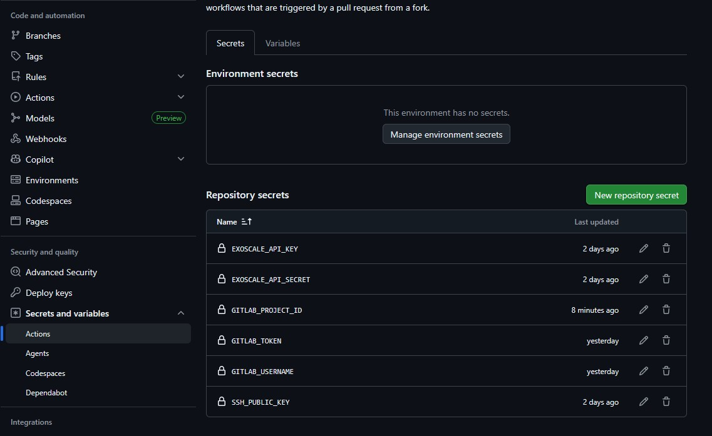

# Abgabe 2 - Andreas Prager

## Übersicht

Unter Verwendung von OpenTofu und CloudInit wird auf der Platform Exoscale vollautomatisch eine virtuelle Maschine erstellt, die einen Web-Service hostet, der einige Systeminformationen über die virtuelle Maschine zur Verfügung stellt.

Als Remote-Backend wird GitLab verwendet, weil GitLab eine native Terraform-State-Integration anbietet, die GitHub nicht bietet.

Wird die Web-Applikation mit dem Ressourcen-Pfad "/" aufgerufen, erhält man eine HTML-Seite, die mit Bootstrap formattiert ist.

Wir die Web-Applikation mit dem Ressourcen-Pfad "/api" aufgerufen, erhält man die Systeminformationen im JSON-Format.

Bei der Web-Applikation handelt es sich um eine Python-Applikation auf Basis des Web-Frameworks "Flask".

## Verwendung

### Secrets

Insgesamt müssen sechs Secrets definiert werden:

- EXOSCALE_API_KEY
- EXOSCALE_API_SECRET
- SSH_PUBLIC_KEY
- GITLAB_USERNAME
- GITLAB_TOKEN
- GITLAB_PROJECT_ID



#### Exoscale

1. Im Menüband auf **IAM**
2. Im Submenüband auf **Keys**
3. Dann auf den Button **Add**
4. Namen für den Key vergeben
5. Wähle role: `User`
6. Klicke auf **Create**
7. Trage den API-Key als **EXOSCALE_API_KEY** auf GitHub ein
8. Trage das API-Secret als **EXOSCALE_API_SECRET** auf GitHub ein

#### GitLab

1. Registrieren/Anmelden auf **GitLab** https://gitlab.com/users/sign_in/
2. Erstellen eines neuen Personal Access Tokens https://gitlab.com/-/user_settings/personal_access_tokens
3. Trage deinen GitLab-Benutzernamen als **GITLAB_USERNAME** auf GitHub ein
4. Trage den soeben generierten Personal Access Token als **GITLAB_TOKEN** auf GitHub ein
5. Neues Repository anlegen
6. Unter https://gitlab.com/{GITLAB_USERNAME}/{REPOSITORY_NAME}/edit die Project-ID als **GITLAB_PROJECT_ID** auf GitHub ein
   1. Im Repository unter **Settings** -> **General** -> **Project ID**

#### SSH

1. Generiere ein neues SSH-Schlüsselpaar
2. Trage den Public-Key als **SSH_PUBLIC_KEY** auf GitHub ein

### Variablen

Alle Secrets werden in Terraform als Variablen definiert und werden in den GitHub-Workflows als Umgebungsvariablen gesetzt.

Darüber hinaus werden die Variablen `zone`, `instance_type` und `vm_disk_size` definiert, um Deployments einfach konfigurieren zu können. Alle drei Variablen haben aber Standardwerte, die zur Lösung der Aufgabe sinnvoll erscheinen.

Dann werden noch drei organisatorische Variablen definiert `owner_name`, `owner_mail` und `namespace`. In der Datei `prager.auto.tfvars` werden diese Variablen für meinen Fall konfiguriert und durch die Dateiendung `*.auto.tfvars` automatisch angewendet. Hierbei handelt es sich nicht, um geheime Daten. Der Owner wird als Tag auf der VM-Ressource gesetzt, die E-Mail wird für die Anfrage des TLS-Zertifikats verwendet und der Namespace wird als Kennzeichnung für die Erstellung aller Ressourcen verwendet, sowie für den DNS-Hostnamen unter dem die Web-Applikation schließlich erreichbar ist.

### Deploy

Das Deployment wird durch die GitHub-Action `Andreas Prager - Terraform Exoscale Deploy` gestartet.

### Destroy

Alle in diesem Projekt erstellten Ressourcen werden mit der GitHub-Action `Andreas Prager - Terraform Exoscale Destroy` gelöscht.

### Lokal

Lokal können die benötigten Secrets und Variablen in Dateien definiert werden. Für diesen Zweck werden die Dateien `secrets.auto.tfvars` und `gitlab.tfbackend` in der .gitignore Datei aus dem Repository ausgeschlossen.

#### Backend

1. Nimm `gitlab.tfbackend.example` und benenne sie in `gitlab.tfbackend` um
2. Ersetze `{GITLAB_USERNAME}` durch deinen Benutzernamen
3. Ersetze `{GITLAB_TOKEN}` durch deinen Token
4. Ersetze `{PROJECT_ID}` durch die Projekt-ID von deinem GitLab-Repository
5. Starte `tofu init` mit dem Backend-Config-Argument

```powershell
tofu init -backend-config="gitlab.tfbackend"
```

#### Exoscale & SSH

1. Definiere in `secrets.auto.tfvars`
   1. exoscale_api_key=EXOSCALE_API_KEY
   2. exoscale_api_secret=EXOSCALE_API_SECRET
   3. ssh_public_key="ALGORITHM KEY COMMENT"
2. Diese Secrets werden nun automatisch bei der Verwendung von `tofu apply` und `tofu destroy` angewendet

## Terraform

### SSH

Über die Datei `ssh.tf` wird der öffentliche Schlüssel zu Exoscale hinzugefügt, damit dieser später beim erstellen der VM referenziert werden kann.

### Security Groups

Über die Datei `security_groups.tf` werden die Security Groups definiert, die wie eine Firewall funktionieren, um Traffic zu kontrollieren.

Es werden zwei Security Groups definiert:
1. Erlaube Port 22 - SSH-Zugriff
2. Erlaube Port 80 & 443 - Web-Zugriff

### VM

Mit der Datei `vm.tf` wird die virtuelle Maschine definiert, die auf Exoscale erzeugt werden soll. Dabei werden die in der Variablen gesetzten Konfigurationwerte verwendet.

Außerdem wird mithilfe einer Data-Source in der Datei `data.tf` die Template-ID der gewünschten Ubuntu-Version ermittelt.

Wie weiter oben bereits erwähnt werden der SSH-Public-Key und die Security-Groups hier mit der VM verknüpft.

Über ein Label wird der Owner gesetzt, der über eine Variable definiert wird.

Über das Attribut `user_data` wird mit dem Template-File `cloudinit.yaml.tftpl` ein Manifest erstellt und an die VM weitergegeben. Über `user_data` wird auch das Python-Programm, sowie ein Template-File, das eine NGINX-Konfiguration erzeugt an die VM weitergegeben.

Außerdem wird definiert, dass Abweichungen zwischen State und Wirklichkeit beim Attribut `user_data` ignoriert werden sollen, da CloudInit ohnehin nur initial und einmal ausgeführt wird.

### DNS

Über die Datei `dns.tf` wird ein A-Record mit dem Hostnamen angelegt, der über die Variable `namespace` definiert wird. Als IP-Adresse wird die öffentliche IP der bereitgestellten VM verwendet.

### TLS

Das TLS-Zertifikat, dass von der Web-Applikation verwendet wird, wird von Terraform verwaltet. Dies geschieht mithilfe des Providers `ruokei/acme`.

In der Datei `tls.tf` wird das TLS-Zertifikat definiert. Dabei wird die per Variable mitgeteilte E-Mailadresse referenziert. Der ACME-Client führt automatisch mithilfe eines TXT-Records eine DNS-Challenge durch. Daher müssen die Exoscale-Credentials definiert werden, da der ACME-Client diesen TXT-Record auf Exoscale anlegt und nach erfolgreicher Challenge auch wieder entfernt.

### Backend

Das Backend wird mit der Datei `backend.tf` definiert. Als Remote-Backend wird GitLab verwendet, dabei muss ein HTTP-Backend verwendet werden, da es kein natives GitLab Backend gibt.

Das Repository sowie der Benutzer mit dem auf das Backend zugegriffen wird, wird mit der Datei `gitlab.tfbackend` definiert und muss beim `tofu init` angegeben werden.

## CloudInit

### Packages

CloudInit installiert die benötigten Python-Pakete für die Flask-Applikation, sowie den NGINX-Webserver, der als Reverse-Proxy für die Web-Applikation verwendet wird. Außerdem wird das Paket `lsb-release`, das zur Erkennung des installierten Betriebssystems in der Python-App verwendet wird, installiert, sollte es nicht standardmäßig installiert sein.

### Files

CloudInit schreibt mehrere Files mit Informationen, die über das Attribut `user_data` an CloudInit weitergegeben wurden:
- Das Zertifikat, sowie der dazugehörende Private-Key im PEM-Format.
- Die Datei `app.py`, die die Flask-Applikation beinhaltet.
- Die NGINX-Konfiguration, die von Terraform mit der Template-Datei `nginx.conf.tftpl` erzeugt wurde.
- Eine Definition der Flask-Applikation als Service im Systemd.

### Script

Zuletzt werden noch einige Bash-Befehle ausgeführt:
- Ein virtuelles Environment für Python wird erstellt.
- Flask und gunicorn werden mit Pip installiert.
- Die Default-Konfiguration von NGINX wird entfernt und die eigene Konfiguration mit Erstellung eines Symlinks aktiviert.
- Der zuvor definierte VM-Info-Service wird gestartet und NGINX noch einmal neugestartet, um die neue Konfiguration zu übernehmen.

## Github Actions

Damit GitHub die Definition der Workflows erkannt, müssen diese im Ordner `.github/workflows` auf Root-Ebene liegen. Daher werden diese nicht im Abgabe-Ordner definiert.

Sowohl Deploy als auch Destroy teilen sich folgende Teile der Definition:
- Als Trigger wird `workflow_dispatch` verwendet, sie laufen also nur, wenn sie manuell gestartet werden.
- Als Working-Directory wird der Terraform-Ordner im Abgabe-Ordner definiert.
- Alle im GitHub-Account definierten Secrets werden als Umgebungsvariablen gesetzt.
- Mithilfe von `setup-opentofu` wird OpenTofu im Runner installiert.

### Deploy

Im Deploy Workflow erfolgt dann zunächst ein Format-Check und eine Validierung der Terraform-Dateien, um Fehler und Inkonsistenzen abzufangen. Schlägt einer der Checks fehl, bricht der Workflow an dieser Stelle ab.

Danach wird mit `tofu plan` und `tofu apply` der gewünschte State des Projekts in Exoscale hergestellt.

### Destroy

Im Destroy Workflow wird das Projekt wieder gelöscht. Dabei wird mit `tofu destroy` alle Ressourcen, die im Projekt definiert wurden, in Exoscale gelöscht.