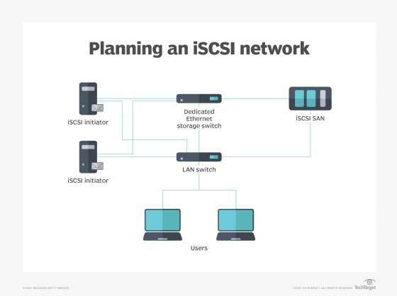

# iSCSI – Erklärung, Einsatz und Bedeutung

## 1. Kurzbeschreibung

**iSCSI** steht für **Internet Small Computer System Interface**. Es ist ein Speicherprotokoll, mit dem SCSI-Befehle über ein normales IP-Netzwerk übertragen werden. Dadurch kann ein Server auf entfernten Speicher zugreifen, als wäre dieser lokal angeschlossen. In der Praxis wird iSCSI häufig verwendet, um Speicherplatz von einem Storage-System oder einem Server mehreren anderen Systemen bereitzustellen.

Das Besondere an iSCSI ist, dass dafür kein eigenes Fibre-Channel-SAN notwendig ist. Stattdessen wird ein vorhandenes Ethernet-Netzwerk verwendet. Die Datenübertragung erfolgt über **TCP/IP**, meistens über den Port **3260/TCP**. Dadurch kann iSCSI relativ einfach in bestehende Netzwerke integriert werden.

> Vereinfacht gesagt:  
> iSCSI macht entfernten Speicher über das Netzwerk für einen Server wie eine lokale Festplatte nutzbar.

---

## 2. Grundprinzip

Bei iSCSI gibt es zwei zentrale Rollen:

| Begriff | Bedeutung |
|---|---|
| **Initiator** | Der Client bzw. Server, der auf entfernten Speicher zugreifen möchte |
| **Target** | Das Zielsystem, das Speicher bereitstellt |
| **LUN** | Logical Unit Number; ein bereitgestellter logischer Speicherbereich |
| **Session** | Verbindung zwischen Initiator und Target |
| **IQN** | iSCSI Qualified Name; eindeutiger Name für Initiator oder Target |

Der **Initiator** sendet SCSI-Kommandos über das Netzwerk an das **Target**. Das Target verarbeitet diese Befehle und stellt dem Initiator einen Speicherbereich zur Verfügung. Dieser Speicher erscheint im Betriebssystem des Initiators häufig wie eine normale lokale Festplatte. Danach kann er partitioniert, formatiert und verwendet werden.




---
## 3. Warum wird iSCSI verwendet?

iSCSI wird eingesetzt, wenn Speicher zentral bereitgestellt werden soll. Das ist besonders in Rechenzentren, Serverräumen, Virtualisierungsumgebungen und Testumgebungen sinnvoll. Mehrere Server können dabei auf zentral verwalteten Speicher zugreifen. Dadurch wird die Verwaltung einfacher, weil Speicher nicht mehr direkt in jedem einzelnen Server eingebaut werden muss.

Typische Einsatzbereiche sind:

- **Virtualisierung**, zum Beispiel für VMware, Hyper-V oder Proxmox
- **Cluster-Systeme**, bei denen mehrere Server gemeinsamen Speicher benötigen
- **Backup- und Recovery-Systeme**
- **Test- und Laborumgebungen**
- **Windows Server iSCSI Target Server**
- **Storage-Systeme in kleinen und mittleren Unternehmen**

Ein Vorteil ist, dass iSCSI auf vorhandener Netzwerktechnik basiert. Unternehmen können Standard-Switches, Netzwerkkarten und IP-Adressierung verwenden. Dadurch ist iSCSI oft günstiger und einfacher einzuführen als klassische SAN-Technologien mit spezieller Hardware.

---

## 4. Vorteile und Nachteile

| Vorteil | Erklärung |
|---|---|
| Nutzung vorhandener Netzwerke | iSCSI verwendet Ethernet und TCP/IP |
| Zentrale Speicherverwaltung | Speicher kann an einer Stelle verwaltet werden |
| Gute Integration | Viele Betriebssysteme unterstützen iSCSI |
| Geringere Kosten | Keine zwingende Spezialhardware wie Fibre Channel notwendig |
| Flexibilität | Speicher kann mehreren Systemen bereitgestellt werden |

| Nachteil / Risiko | Erklärung |
|---|---|
| Netzwerkabhängigkeit | Fällt das Netzwerk aus, ist auch der Speicherzugriff betroffen |
| Performance abhängig vom Netzwerk | Bandbreite, Latenz und Switches sind entscheidend |
| Sicherheitsrisiken | Falsche Konfiguration kann unberechtigten Zugriff ermöglichen |
| Komplexität bei Fehlern | Probleme können im Storage, Netzwerk oder Betriebssystem liegen |
| Kein Ersatz für Backup | iSCSI stellt Speicher bereit, schützt aber nicht automatisch vor Datenverlust |

---

## 5. Technische Funktionsweise

iSCSI kapselt SCSI-Kommandos in TCP/IP-Pakete. Der Server arbeitet weiterhin mit Blockspeicher. Das bedeutet: Aus Sicht des Betriebssystems wird nicht einfach ein Ordner im Netzwerk geöffnet, sondern ein Speicherblockgerät bereitgestellt. Das unterscheidet iSCSI von klassischen Dateifreigaben wie SMB oder NFS.

Ein typischer Ablauf sieht so aus:

1. Das Target stellt eine LUN bereit.
2. Der Initiator sucht oder kennt das Target.
3. Der Initiator meldet sich beim Target an.
4. Zwischen Initiator und Target wird eine iSCSI-Session aufgebaut.
5. Das Betriebssystem erkennt den entfernten Speicher als Datenträger.
6. Der Datenträger kann partitioniert, formatiert und genutzt werden.

Für die Identifikation werden häufig **IQNs** verwendet. Ein IQN sieht zum Beispiel so aus:

```text
iqn.2026-06.local.example:storage01.lun01
```

Dieser Name hilft dabei, Initiatoren und Targets eindeutig zu unterscheiden. In produktiven Umgebungen ist diese eindeutige Benennung wichtig, damit Speicherzugriffe kontrolliert und nachvollziehbar bleiben.

---

## 6. iSCSI im Vergleich zu SMB/NFS

iSCSI wird manchmal mit Netzwerkfreigaben verwechselt. Der wichtigste Unterschied liegt darin, dass iSCSI **Blockspeicher** bereitstellt, während SMB und NFS **Dateispeicher** bereitstellen.

| Merkmal | iSCSI | SMB / NFS |
|---|---|---|
| Speicherart | Blockspeicher | Dateispeicher |
| Nutzung | Wie lokale Festplatte | Wie Netzwerkordner |
| Typischer Einsatz | Virtualisierung, Datenbanken, Cluster | Dateiablage, Home-Laufwerke |
| Formatierung | Erfolgt am Client/Initiator | Erfolgt am Server |
| Zugriff | Meist exklusiv pro Dateisystem | Mehrbenutzer-Dateizugriff möglich |

Diese Unterscheidung ist wichtig: Wenn mehrere Systeme gleichzeitig auf dieselbe iSCSI-LUN schreiben, kann es ohne geeignetes Cluster-Dateisystem zu Datenbeschädigung kommen. Deshalb muss genau geplant werden, welches System welchen Speicher verwenden darf.

---

## 7. Sicherheit bei iSCSI

Da iSCSI über IP-Netzwerke läuft, muss die Absicherung sorgfältig geplant werden. Ein falsch konfiguriertes iSCSI-Netz kann dazu führen, dass ein Server Zugriff auf Speicher erhält, für den er nicht vorgesehen ist.

Wichtige Sicherheitsmaßnahmen sind:

- eigenes VLAN oder separates Storage-Netzwerk verwenden
- Zugriff auf bestimmte Initiatoren beschränken
- CHAP-Authentifizierung verwenden
- Firewall-Regeln für Port 3260/TCP setzen
- Management- und Storage-Netz trennen
- keine iSCSI-Zugriffe ungeschützt über öffentliche Netze erlauben
- Monitoring für Verbindungsabbrüche und Performance einsetzen

> Wichtig:  
> iSCSI ist technisch leistungsfähig, aber die Sicherheit hängt stark von der Netzwerk- und Storage-Konfiguration ab.

---

## 8. Performance und Verfügbarkeit

Die Leistung von iSCSI hängt stark vom Netzwerk ab. Besonders wichtig sind Bandbreite, Latenz, Switch-Qualität und die Anzahl der parallelen Zugriffe. In produktiven Umgebungen werden häufig schnelle Netzwerke mit 10 Gbit/s oder mehr verwendet. Auch getrennte Storage-Netze sind üblich, damit normaler Benutzerverkehr den Speicherzugriff nicht stört.

Für höhere Verfügbarkeit werden oft mehrere Netzwerkpfade verwendet. Dieses Konzept heißt **Multipath I/O** oder kurz **MPIO**. Dabei gibt es mehrere Verbindungen zwischen Initiator und Target. Wenn ein Pfad ausfällt, kann ein anderer Pfad weiterverwendet werden. Zusätzlich kann die Last auf mehrere Pfade verteilt werden.

---


## Quellen

[1] IETF: **RFC 7143 – Internet Small Computer System Interface (iSCSI) Protocol (Consolidated)**  
https://datatracker.ietf.org/doc/html/rfc7143

[2] Microsoft Learn: **iSCSI Target Server Overview**  
https://learn.microsoft.com/en-us/windows-server/storage/iscsi/iscsi-target-server

[3] IBM Documentation: **iSCSI overview**  
https://www.ibm.com/docs/en/flashsystem-c200/9.1.2?topic=attachment-iscsi-overview

[4] SNIA: **Q&A on Exactly How iSCSI has Evolved**  
https://www.snia.org/blog/2016/qa-exactly-how-iscsi-has-evolved-0

[5] IBM Documentation: **iSCSI software initiator considerations / MPIO**  
https://www.ibm.com/docs/ssw_aix_72/network/iscsi_considerations.html

