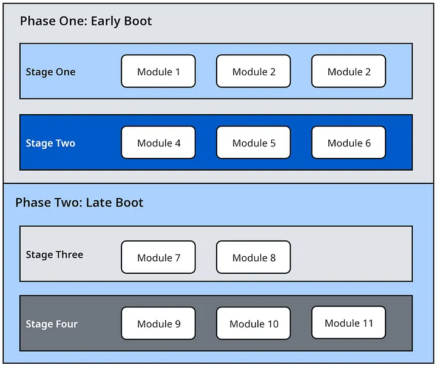
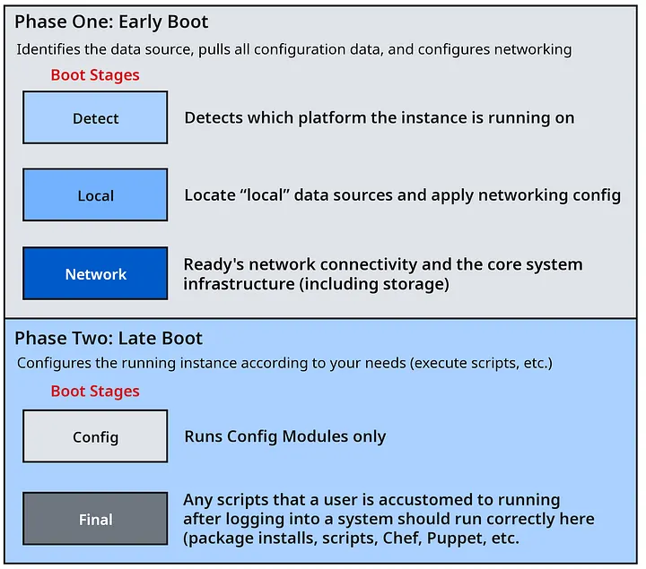
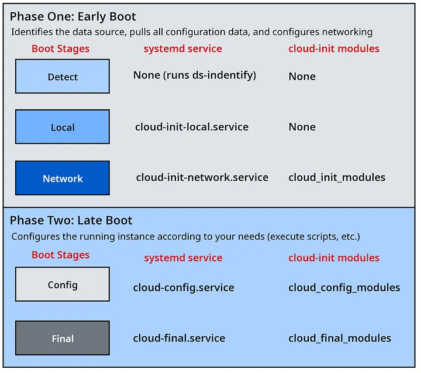

# Cloud-Init Ausarbeitung
## Definition
Cloud-Init ist eine Open-Source-Software für Cloud-Server-Instanzen, um Server automatisch anhand der bereitgestellten Metadaten einzurichten. Es wird von vielen Cloud-Anbietern wie AWS, Azure und Google Cloud unterstützt und ist für zahlreiche Linux-Distributionen wie Ubuntu, Debian, Fedora oder AlmaLinux sowie teilweise auch für BSD-Systeme verfügbar.

 Cloud-Init wird beim ersten Start eines Systems ausgeführt, um Betriebssystem-Images automatisiert zu konfigurieren und an individuelle Anforderungen anzupassen. Zu den typischen Aufgaben zählen die Vergabe von Hostnamen, das Erstellen von Benutzern, die Einrichtung von SSH-Schlüsseln sowie das Ausführen von Skripten.

## Funktion - Workflow
Im Folgenden wird der grundlegende Ablauf von Cloud-Init beim Erstellen und Starten einer virtuellen Maschine beschrieben.

1.	Start der virtuellen Maschine
Beim ersten Start einer neuen virtuellen Maschine wird Cloud-Init bereits früh im Bootvorgang ausgeführt. 
2.	Erkennung der Datenquellen
Cloud-Init sucht nach Konfigurationsdaten aus unterschiedlichen Quellen, beispielsweise: 
    -	Metadaten-Diensten von Cloud-Anbietern wie AWS, Azure oder Google Cloud 
    -	An die virtuelle Maschine angebundenen Konfigurationsdateien
    - Netzwerkbasierte Quellen 
3.	Einlesen der Konfiguration
Die gefundenen Konfigurationsdaten werden ausgelesen und verarbeitet. Üblicherweise erfolgt dies im YAML-Format. 
4.	Anwendung der Einstellungen
Auf Basis der bereitgestellten Konfiguration werden verschiedene Systemeinstellungen automatisch vorgenommen, darunter: 
    -	Erstellung von Benutzerkonten und SSH-Schlüsseln 
    -	Netzwerkkonfiguration 
    -	Installation von Paketen 
    -	Erstellung von Dateien 
    -	Ausführung benutzerdefinierter Skripte 

Cloud-Init kann dabei als eine Art automatisierter Einrichtungsassistent für virtuelle Maschinen betrachtet werden. Anstatt ein System nach dem ersten Start manuell konfigurieren zu müssen, werden die gewünschten Einstellungen in einer Konfigurationsdatei definiert und anschließend automatisch umgesetzt.

## Hierarchie
Die Hierarchie der verschiedenen Komponenten teil sich in Phases and Stages auf. Phasen beschreiben den allgemeinen Kontext während des Systemstarts, während Stages festlegen, zu welchem Zeitpunkt bestimmte Prozesse ausgeführt werden. Die eigentlichen Aufgaben werden durch Module umgesetzt. Diese Module werden abhängig von den Anforderungen der jeweiligen Stage unterschiedlichen Ausführungsphasen zugeordnet.



### Phases
Der Bootprozess von Cloud-Init besteht aus zwei Phases: einer frühen Phase vor der Netzwerkverbindung und einer späteren Phase nach der Netzwerkeinrichtung. Diese Aufteilung ist notwendig, da bestimmte Konfigurationen bereits vor dem Netzwerkstart erfolgen müssen, während andere eine aktive Netzwerkverbindung benötigen.

**Phase One (Early Boot):** In der frühen Startphase, also vor der Netzwerkeinrichtung, erkennt Cloud-Init die verfügbare Datenquelle, lädt die Konfigurationsdaten und richtet die Netzwerkverbindung ein.

**Phase Two (Late Boot):** Nach der erfolgreichen Netzwerkkonfiguration führt Cloud-Init weitere Aufgaben aus, die für die eigentliche Bereitstellung nicht zwingend erforderlich sind. Dabei wird das System anhand der definierten Vendor-Data- und User-Data-Konfiguration an die gewünschten Anforderungen angepasst.

### The 5 Boot Stages
Innerhalb der beiden Boot Phases befinden sich sogenannte Stages. Jede Stage beschreibt einen bestimmten Abschnitt im Bootvorgang, in dem definierte Aufgaben und Konfigurationsschritte ausgeführt werden.



Die einzelnen Boot-Stages werden innerhalb der beiden Bootphasen als systemd-Services ausgeführt.

**Detect:** Erkennung der verwendeten Plattform und Datenquelle der virtuellen Maschine.

**Local:** Verarbeitung lokaler Datenquellen und grundlegende Netzwerkkonfiguration.

**Network:** Aktivierung der Netzwerkverbindung und Vorbereitung weiterer Systemressourcen.

**Config:** Ausführung von Konfigurationsaufgaben wie Benutzer- oder Paketverwaltung.

**Final:** Durchführung abschließender Skripte und Softwareinstallationen nach dem Systemstart.

### Modules
Die Stages lassen sich weiter in Modules unterteilen. Modules stellen die eigentlichen funktionalen Komponenten dar, welche die definierten Aufgaben und Konfigurationen ausführen. Modules Liste: [cloud-init documentation](https://cloudinit.readthedocs.io/en/latest/reference/modules.html#)

Die Modules sind auf ihre jeweilige Funktion abgestimmt. Sie übernehmen die eigentliche Ausführung der Aufgaben innerhalb der einzelnen Stages und ermöglichen dadurch eine strukturierte sowie deklarative Konfiguration des Systemstarts.
 


## Beispiel
Beispiel für die Einrichtung einer Instanz durch eine Konfigurationsdatei im YAML Format:

```
#cloud-config
users:
    - default
disable_root: true
preserve_hostname: false
apt_preserve_sources_list: true
system_info:
   distro: debian
   default_user:
      name: debian
      lock_passwd: True
      gecos: Debian
      groups: [adm, audio, cdrom, dialout, dip, floppy, netdev, plugdev, sudo, video]
      sudo: ["ALL=(ALL) NOPASSWD:ALL"]
      shell: /bin/bash
   paths:
      cloud_dir: /var/lib/cloud/
      templates_dir: /etc/cloud/templates/
      upstart_dir: /etc/init/
   package_mirrors:
     - arches: [default]
       failsafe:
         primary: http://deb.debian.org/debian
         security: http://security.debian.org/
   ssh_svcname: ssh
bootcmd:
  - echo “Hello world!” > /home/hello.txt
packages:
  - vim
  - git
  - htop
```

Der Aufbau einer Cloud-Init-Datei beginnt immer mit `#cloud-config`. Dadurch erkennt Cloud-Init, dass es sich um eine Konfigurationsdatei handelt. Danach folgen einzelne Abschnitte im YAML-Format, zum Beispiel für Benutzer, Systeminformationen, Befehle und Pakete.

1. Benutzerkonfiguration
    ```
    users:
        - default
    disable_root: true
    ```
    Hier wird der Standardbenutzer des Systems verwendet. Gleichzeitig wird der direkte Zugriff auf den root-Benutzer deaktiviert.

2. Hostname und Paketquellen
    ```
    preserve_hostname: false
    apt_preserve_sources_list: true
    ```
    `preserve_hostname`: false bedeutet, dass Cloud-Init den Hostnamen verändern darf. Mit `apt_preserve_sources_list`: true bleiben die vorhandenen Paketquellen erhalten.

3. Grundkonfiguration des Systems
    ```
    system_info:
      distro: debian
    ```
    Dieser Abschnitt beschreibt grundlegende Systeminformationen. In diesem Beispiel wird Debian als Betriebssystem angegeben.

4. Standardbenutzer
    ```
    default_user:
      name: debian
      lock_passwd: True
      groups: [...]
      sudo: ["ALL=(ALL) NOPASSWD:ALL"]
      shell: /bin/bash
   ```
   Hier wird der Standardbenutzer `debian` definiert. Das Passwort ist gesperrt, der Benutzer wird mehreren Gruppen zugeordnet und erhält sudo-Rechte ohne Passwortabfrage. Als Standardshell wird /bin/bash verwendet.

5. Cloud-Init-Pfade und Paketquellen
    ```
    paths:
      cloud_dir: /var/lib/cloud/
      templates_dir: /etc/cloud/templates/
      upstart_dir: /etc/init/
    package_mirrors:
     - arches: [default]
       failsafe:
         primary: http://deb.debian.org/debian
         security: http://security.debian.org/
      
    ```
    Dieser Bereich legt fest, wo Cloud-Init seine Daten und Vorlagen speichert. Zusätzlich werden unter `package_mirrors` die Debian-Paketquellen definiert.

6. Befehle beim Bootvorgang
    ```
    bootcmd:
      - echo “Hello world!” > /home/hello.txt
    ```
    Mit `bootcmd` wird sehr früh im Bootvorgang ein Befehl ausgeführt. In diesem Fall wird die Datei `/home/hello.txt` erstellt und mit dem Inhalt „Hello world!“ befüllt.

7. Paketinstallation
    ```
    packages:
      - vim
      - git
      - htop
    ```
    Am Ende werden die Programme `vim`, `git` und `htop` automatisch installiert.

## Quellen
Alle Quellen die für diese Ausarbeitung verwendet wurden:
- [Cloud-init](https://cloud-init.io/)
- [Cloud-init documentation](https://docs.cloud-init.io/en/latest/)
- [Cloud-init: Less Scary Than You Init-ially Thought](https://medium.com/@jeremycastle/cloud-init-less-scary-than-you-init-ially-thought-3db8c42543cc)
- [Was ist Cloud-Init und warum ist es so cool?](https://contabo.com/blog/de/was-ist-cloud-init/)