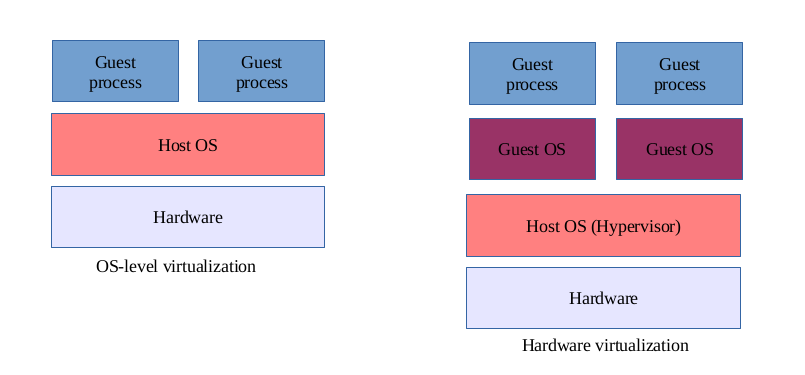
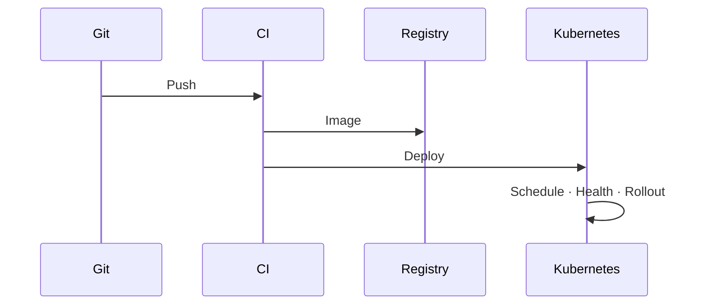
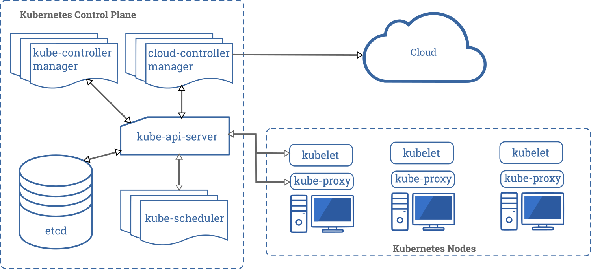

# Cloud Native – Was bedeutet der Begriff?

| | |
|---|---|
| **Thema** | What does „Cloud Native“ mean? |
| **Kurs** | BITI VICA – Virtualisierung SS26 |
| **Autor** | Raphael Wagner |
| **Abgabe** | `Abgabe_2_260519` |

---

## Kurzüberblick

| Frage | Antwort in einem Satz |
|-------|------------------------|
| **Was?** | Paradigma für Software, die **verteilte, elastische** Infrastruktur nutzt – nicht nur „in der Cloud läuft“. |
| **Wie?** | Container, Automatisierung, kleine Services, deklaratives Deploy. |
| **Warum?** | Schnellere Releases, horizontale Skalierung, Ausfälle abfangen ohne Totalausfall. |
| **Wer definiert?** | u. a. [CNCF](https://github.com/cncf/toc/blob/main/DEFINITION.md) |

Der Begriff beschreibt damit vor allem **Architektur und Betrieb**, nicht den Standort einer VM bei einem Cloud-Anbieter.

---

## 1. Worum handelt es sich?

**Cloud Native** ist ein Gestaltungs- und **Betriebsmodell** für Anwendungen, die in dynamischer, verteilter Infrastruktur laufen. Ziel ist, Lastspitzen und Ausfälle ohne manuelle Eingriffe abzufangen.

**CNCF-Kernkonzepte:**

- Container · Microservices · Service Mesh  
- Unveränderliche Infrastruktur · Deklarative APIs  

Die CNCF fasst darunter Technologien und Praktiken, mit denen Teams Software **programmatisch und wiederholbar** bereitstellen – unabhängig davon, ob die Infrastruktur public, private oder hybrid betrieben wird.

**Nicht gemeint:** ein Cloud-Tarif, ein einzelnes Produkt oder „einfach eine VM bei AWS“.

**Leitprinzipien (Kurz):**

| Prinzip | Bedeutung |
|---------|-----------|
| Unveränderliche Artefakte | Kein Patching auf laufenden Instanzen – neues Image deployen |
| Stateless Prozesse | Session/Daten in Backing Services, nicht im Container |
| Deklarativ | Soll-Zustand in Git/Manifesten, System korrigiert Abweichungen |
| Observability | Metriken + Logs + Traces für viele kurzlebige Instanzen |

### Cloud Hosted vs. Cloud Native

Viele Unternehmen betreiben Software zwar in der Cloud, arbeiten aber weiter wie im eigenen Rechenzentrum. Der Unterschied liegt in der **Art der Anwendung und des Deployments**:

| | Cloud Hosted | Cloud Native |
|---|--------------|--------------|
| **Ansatz** | Lift-and-Shift | Architektur + Prozess wandeln |
| **App** | Monolith auf großer VM | Viele kleine Services |
| **Skalierung** | Vertikal | Horizontal |
| **Deploy** | Selten, manuell | Häufig, automatisiert |
| **Zustand** | Oft im Prozess | Backing Services |
| **Ausfall** | Wartungsfenster, SPOF | Replikate, Selbstheilung |

**Verwandte Ideen:** Die [12-Factor App](https://12factor.net/) formuliert viele dieser Gedanken schon früh (stateless, Config in Env, Logs als Stream). Cloud Native ergänzt das um Orchestrierung, Observability und DevOps-Praktiken.

---

## 2. Kontext der Verwendung

Cloud Native wird dort diskutiert, wo **Entwicklung, Betrieb und Geschäft** zusammenkommen – nicht nur in der IT-Abteilung.

| Bereich | Typische Themen |
|---------|-----------------|
| **Architektur** | Microservices vs. Monolith, APIs, Events |
| **DevOps / Platform** | CI/CD, GitOps, interne Dev-Plattform |
| **Infrastruktur** | Kubernetes, Managed Services, Hybrid/Multi-Cloud |
| **Security** | RBAC, Secrets, Network Policies, Policy-as-Code |
| **Organisation** | Kleine Teams, „You build it, you run it“ |
| **Vorlesung Virtualisierung** | Container (cgroups/namespaces), Orchestrator über viele Knoten |

In der Praxis starten viele Organisationen mit **Lift-and-Shift** und modernisieren später schrittweise (Strangler-Fig: neue Funktionen als neue Services, Legacy bleibt vorerst bestehen).

### Virtualisierung: Hardware-VM vs. OS-Container

Für die Vorlesung ist wichtig: Cloud Native baut auf **OS-Virtualisierung** auf, nicht auf einem vollständigen Gast-Betriebssystem pro Anwendung wie bei klassischen VMs.

*Abb. 1 – Links virtualisiert der Hypervisor die Hardware (eigene VMs mit Gast-OS); rechts teilen sich Container den Kernel des Host-Systems. Quelle: [Wikimedia Commons](https://commons.wikimedia.org/wiki/File:OS_vs_Hardware_virtualization.png), CC0.*

Ein **Orchestrator** wie Kubernetes verteilt Container-Workloads anschließend auf viele Knoten und übernimmt Netzwerk, Storage und Skalierung – eine weitere Abstraktionsebene über dem Container.

---

## 3. Technische Funktionsweise (grob)

Technisch betrachtet folgt eine cloud-native Anwendung einem festen **Pipeline-Muster**: Code wird gebaut, als Image versioniert, deklarativ ausgerollt und im Betrieb überwacht.

### Lebenszyklus

| Schritt | Was passiert |
|---------|----------------|
| 1. Build | CI baut Code, Tests, **Container-Image** (OCI) |
| 2. Registry | Image versioniert ablegen |
| 3. Deklarieren | Manifeste: Replikate, Ressourcen, Netzwerk |
| 4. Reconcile | Controller gleicht Soll/Ist ab, startet Pods neu |
| 5. Traffic | Service + Ingress, Pods sind **ephemeral** |
| 6. Skalieren | HPA / KEDA bei Last oder Queue |
| 7. Beobachten | Metriken, Logs, Traces |

Schritt 4 ist zentral: Statt manuell Server einzurichten, beschreibt man den **gewünschten Zustand**; die Plattform setzt ihn durch und hält ihn aufrecht.

*Abb. 3 (Mermaid) – Vereinfachter Ablauf von Commit bis laufendem Deployment.*

In verteilten Systemen gilt oft **eventuelle Konsistenz** (CAP-Theorem): Services tauschen Daten asynchron aus oder arbeiten idempotent, statt alles in einer einzigen Datenbanktransaktion zu bündeln.

| Begriff | Kurz erklärt |
|---------|----------------|
| Pod | Kleinste Ausführungseinheit in Kubernetes (ein oder mehrere Container) |
| Ingress | Externer HTTP(S)-Zugang zum Cluster |
| GitOps | Cluster-Zustand wird aus Git-Repo synchronisiert |
| IaC | Infrastruktur per Code (Terraform, …) versionieren |

---

## 4. Architektur

Die folgenden Abbildungen zeigen, wie ein typischer Kubernetes-Cluster aufgebaut ist und wie die Komponenten zusammenspielen.

*Abb. 2 – **Control Plane** (Steuerung) und **Worker Nodes** (Ausführung). Quelle: [Kubernetes Documentation](https://kubernetes.io/docs/concepts/architecture/), Apache-2.0.*

*Abb. 3 – API-Server, Scheduler, Controller, kubelet und Container-Runtime im Zusammenspiel. Quelle: [Kubernetes Components](https://kubernetes.io/docs/concepts/overview/components/), Apache-2.0. Offizielles PNG von kubernetes.io (statt SVG wegen Lesbarkeit auf GitHub).*

Darüber liegt die **Anwendungsarchitektur** – oft als Microservices modelliert:

| Schicht | Komponenten |
|---------|-------------|
| **Zugriff** | Clients, API Gateway / Ingress |
| **Anwendung** | Microservices in Pods |
| **Plattform** | Scheduler, Controller, optional Service Mesh |
| **Daten** | DB, Queues, Object Storage (managed) |
| **Betrieb** | Prometheus, OTel, RBAC, Secrets |
| **Lieferung** | Git, CI, Registry, GitOps/CD |

Jeder Service sollte eine **eigene Deploy-Einheit** haben und idealerweise seine Daten selbst verwalten (Database-per-Service). Die Kommunikation erfolgt über Netzwerk-APIs – synchron (HTTP/gRPC) oder asynchron (z. B. Kafka).

### CNCF-Ökosystem

Die CNCF bündelt und prüft Open-Source-Projekte rund um Cloud Native. Eine vollständige Übersicht bietet die interaktive Landscape; das Logo steht für die Organisation dahinter.

*Abb. 4 – CNCF koordiniert das Ökosystem. Projektübersicht: [CNCF Landscape](https://landscape.cncf.io/) (CC BY 4.0). Logo: [CNCF Artwork](https://github.com/cncf/artwork), Apache-2.0.*

---

## 5. Protokolle, Tools, Anbieter

Die folgende Tabelle listet keine Vollständigkeit, sondern **typische Bausteine** im Stack. In der Praxis wählt man pro Schicht wenige, gut integrierte Werkzeuge.

| Kategorie | Beispiele |
|-----------|-----------|
| Standards | OCI, CNI, CSI, OpenAPI, gRPC |
| Orchestrierung | **Kubernetes**, Nomad |
| Laufzeit | containerd, CRI-O |
| Mesh | Istio, Linkerd, Cilium |
| CI/CD | GitHub Actions, Argo CD, Flux |
| IaC | Terraform, Helm |
| Observability | Prometheus, Grafana, OpenTelemetry |
| Managed K8s | EKS, AKS, GKE |
| CNCF | Envoy, etcd, … (siehe Abb. 4 / Landscape) |

**Cloud-Anbieter** stellen oft verwaltete Kubernetes-Cluster und Backing Services bereit. Die Wahl hängt von Region, Compliance und bestehenden Verträgen ab:

| Region | Beispiele |
|--------|-----------|
| Global | AWS, Azure, Google Cloud |
| DACH/EU | IONOS, OVHcloud, STACKIT, Exoscale |

Cloud Native ist **anbieterübergreifend** gedacht (offene Standards wie OCI und Kubernetes), auch wenn einzelne Managed Services proprietär bleiben.

---

## 6. Anwendungen & Grenzen

Cloud Native lohnt sich besonders, wenn **Skalierung, Verfügbarkeit oder Release-Tempo** kritisch sind. Nicht jedes Projekt braucht Microservices.

| Szenario | Nutzen |
|----------|--------|
| E-Commerce | Nur Checkout bei Lastspitzen skalieren |
| Streaming | Stateless API + CDN |
| FinTech | Isolierte Services, schnelle Releases |
| IoT | Events über Queues (z. B. Kafka) |

| Sinnvoll wenn … | Vorsicht wenn … |
|-----------------|-----------------|
| Hohe Lastschwankungen | Kleines Team, einfache Domain |
| Viele Releases nötig | Wenig Ops-Kapazität |
| Ausfallsicherheit wichtig | Monolith reicht aus |

Microservices erhöhen **Netzwerk- und Betriebskomplexität** (mehr Services zu debuggen, mehr Schnittstellen). Für viele Teams ist ein **modularer Monolith** mit cloud-native Prinzipien (CI/CD, 12-Factor, Observability) die pragmatischere Wahl – Cloud Native als Mittel, nicht als Selbstzweck.

---

## Quellen

| Nr. | Quelle | Link |
|-----|--------|------|
| 1 | CNCF – Definition | https://github.com/cncf/toc/blob/main/DEFINITION.md |
| 2 | 12-Factor App | https://12factor.net/ |
| 3 | Kubernetes Documentation | https://kubernetes.io/docs/home/ |
| 4 | NIST SP 800-145 | https://csrc.nist.gov/publications/detail/sp/800-145/final |
| 5 | Fowler – Microservices | https://martinfowler.com/microservices/ |
| 6 | Newman – *Building Microservices*, O’Reilly | ISBN 978-1492034025 |
| 7 | Burns et al. – *Kubernetes: Up and Running*, O’Reilly | ISBN 978-1098110201 |
| 8 | Abb. 1 – Wikimedia Commons (CC0) | https://commons.wikimedia.org/wiki/File:OS_vs_Hardware_virtualization.png |
| 9 | Abb. 2/3 – Kubernetes Docs (Apache-2.0) | https://kubernetes.io/docs/concepts/architecture/ |
| 10 | Abb. 4 – CNCF Logo (Apache-2.0) | https://github.com/cncf/artwork |
| 11 | CNCF Landscape (interaktiv, CC BY 4.0) | https://landscape.cncf.io/ |

*Abbildungen liegen lokal unter `Wagner_Raphael/assets/`. Stand: Mai 2026.*
